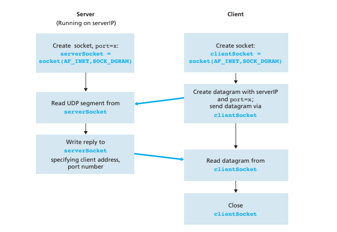

# DAT204_socketProgramming
A simple socket programming example for DAT204

- [x] UDPClient.py
- [x] UDPServer.py
- [x] TCPClient.py
- [x] TCPServer.py

The following simple client-server application demonstrates socket programming for both UDP and TCP:
The application will do the following:
1. The client reads a line of characters (data) from its keyboard and sends the data
to the server.fa
2. The server receives the data and converts the characters to uppercase.
3. The server sends the modified data to the client.
4. The client receives the modified data and displays the line on its screen.

Figure highlights the main socket-related activity of the client and server that communicate over the UDP transport service

Make sure you are not using well-known ports: (https://packetlife.net/media/library/23/common_ports.pdf)
